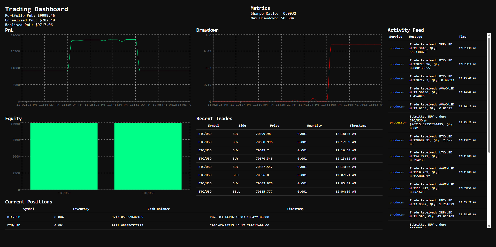

# Real-Time Algorithmic Trading Pipeline

## Overview
Trading Pipeline that uses real-time Alpaca data to simulate crypto trades for customisable tickers using the Avellaneda Stoikov Model. Includes a dashboard featuring trade activity, key metrics and charts. 

Uses Alpaca's Websockeet API and Kafka for message processing. Each tick is filtered through a Kalman Filter for fair price estimation, and then fed into AS model for optimal bid/ask quotes. Order execution is assumed to be guaranteed, and persisted in PostgreSQL via a FastAPI REST API and React dashboard. Entire stack runs in Docker Compose.

## Tech Stack

**Frontend**
- React, Recharts, Axios, Node.js

**Backend**
- FastAPI, Python

**Data & Messaging**
- Apache Kafka, Zookeeper

**Database**
- PostgreSQL

**Monitoring**
- Prometheus, Grafana

**Market Data**
- Alpaca WebSocket API

**Quantitative Models**
- Kalman Filter
- Avellaneda-Stoikov Market Making Model

**Infrastructure**
- Docker, Docker Compose

**Key Libraries**
- confluent-kafka, numpy, psycopg2, alpaca-py

## Architecture
## Architecture

```
Alpaca WebSocket API
        ↓
    Producer
    (Python)
        ↓
   Kafka Topic
   (raw-ticks)
        ↓
 Signal Processor
    (Python)
  Kalman Filter
Avellaneda-Stoikov
        ↓
   Kafka Topic
(trading-signals)
        ↓
  Order Executor
    (Python)
        ↓
    PostgreSQL
        ↓
   FastAPI REST API
        ↓
  React Dashboard
  
  All services monitored by Prometheus + Grafana
```

Each service runs as an independent Docker container communicating exclusively through Kafka topics and the PostgreSQL database. The Producer ingests live tick data from Alpaca and publishes to the `raw-ticks` topic. The Signal Processor consumes ticks, runs them through a Kalman Filter to estimate fair price, then applies the Avellaneda-Stoikov model to generate optimal bid/ask quotes and publishes signals to `trading-signals`. The Order Executor simulates fills and persists all trades, positions and PnL to PostgreSQL. FastAPI exposes this data via REST endpoints consumed by the React dashboard.

## Getting Started
### Prerequisites:
- Docker Desktop
- Node.js
- Alpaca Paper Trading Account
- Python 3.11+

### 1. Clone the Repo
``` bash
git clone https://github.com/mpp38544/realtime-trading-pipeline.git
cd realtime-trading-pipeline
```

### 2. Configure Environment Variables
Create a `.env` file in the project root:
```
ALPACA_API_KEY=your_api_key_here
ALPACA_SECRET_KEY=your_secret_key_here
KAFKA_BOOTSTRAP_SERVERS=localhost:9092
POSTGRES_HOST=localhost
POSTGRES_PORT=5433
```
### 3. Install Python Dependencies
```bash
pip install -r producer/requirements.txt
pip install -r signal-processor/requirements.txt
pip install -r order-executor/requirements.txt
pip install -r api/requirements.txt
```

### 4. Install React Dependencies
```bash
cd dashboard
npm install
```

### 5. Start the Stack
```bash
docker compose up --build -d
```

### 6. Start the Dashboard
```bash
cd dashboard
npm run dev
```

### 7. Access Services
| Service         | URL                        |
|-----------------|----------------------------|
| React Dashboard | http://localhost:5174      |
| FastAPI docs    | http://localhost:8000/docs |
| Grafana         | http://localhost:3000      |
| Prometheus      | http://localhost:9090      |


## Project Structure
```
realtime-trading-pipeline/
├── producer/
│   ├── producer.py          # Alpaca WebSocket → Kafka producer
│   ├── requirements.txt
│   └── Dockerfile
├── signal-processor/
│   ├── signal_processor.py  # Kalman Filter + Avellaneda-Stoikov model
│   ├── requirements.txt
│   └── Dockerfile
├── order-executor/
│   ├── order_executor.py    # Simulated order fills + PostgreSQL writes
│   ├── init_db.py           # Database schema initialisation
│   ├── reset_db.py          # Clears all trading data
│   ├── requirements.txt
│   └── Dockerfile
├── api/
│   ├── main.py              # FastAPI REST endpoints
│   ├── database.py          # PostgreSQL connection factory
│   └── requirements.txt
├── dashboard/
│   └── src/
│       ├── App.jsx
│       └── components/
│           ├── Header.jsx        # Portfolio PnL
│           ├── Metrics.jsx       # Sharpe ratio + max drawdown
│           ├── PnLChart.jsx      # Portfolio PnL over time
│           ├── DrawdownChart.jsx # Drawdown over time
│           ├── PositionBarChart.jsx # Per-symbol PnL
│           ├── Positions.jsx     # Current inventory
│           └── Trades.jsx        # Recent trade history
├── docker-compose.yml
├── prometheus.yml
├── requirements.txt
└── .env
```

## How It Works

### 1. Data Ingestion
The Producer connects to Alpaca's WebSocket API and subscribes to live trade events for a configurable list of crypto pairs. Each incoming tick is serialised to JSON and published to the `raw-ticks` Kafka topic.

### 2. Signal Processing
The Signal Processor maintains independent state per symbol — a Kalman Filter and Avellaneda-Stoikov model instance for each tracked asset. 

For each incoming tick it:
- Seeds the Kalman Filter with the raw price to estimate a smoothed fair value
- Calculates short-term volatility using an EWMA on log returns
- Feeds fair price, volatility, current inventory and time remaining into the A-S model to compute optimal bid/ask quotes
- Publishes BUY and SELL signals to the `trading-signals` topic when position limits allow

### 3. Order Execution
The Order Executor consumes signals and simulates fills at the quoted price, updating per-symbol inventory and cash balance. Every fill is persisted to PostgreSQL across three tables — `trades`, `positions`, and `pnl` — with portfolio PnL calculated as the sum of unrealised and realised PnL across all symbols.

### 4. API Layer
FastAPI exposes several REST endpoints serving live trading data from PostgreSQL. The `/metrics` endpoint computes Sharpe ratio and max drawdown on the fly from the full PnL history.

### 5. Dashboard
The React dashboard polls all endpoints every 5 seconds and renders:
- **Portfolio PnL** — current total account value
- **Sharpe Ratio** — risk-adjusted return
- **Max Drawdown** — largest peak-to-trough decline
- **PnL Chart** — portfolio value over time
- **Drawdown Chart** — drawdown percentage over time
- **Position Bar Chart** — per-symbol total value
- **Positions Table** — current inventory and cash per symbol
- **Trades Feed** — most recent trade executions

## Dashboard

